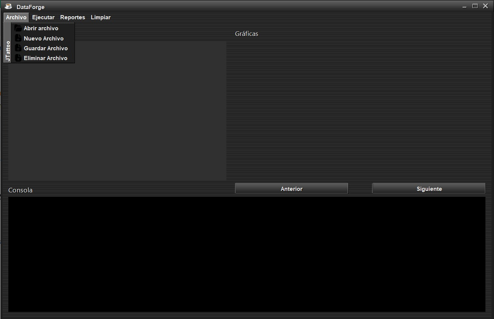
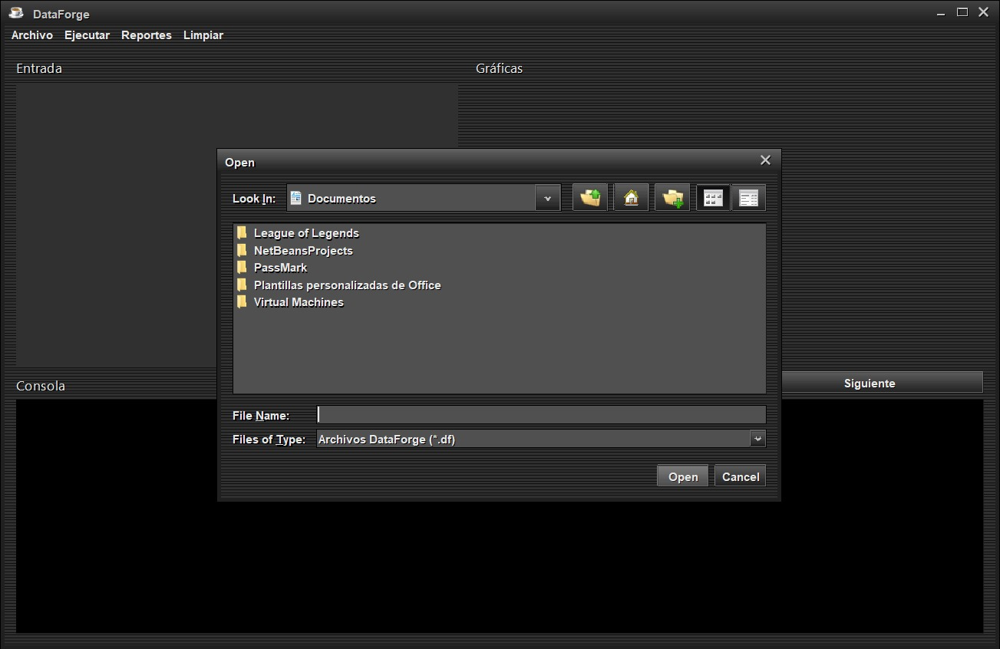
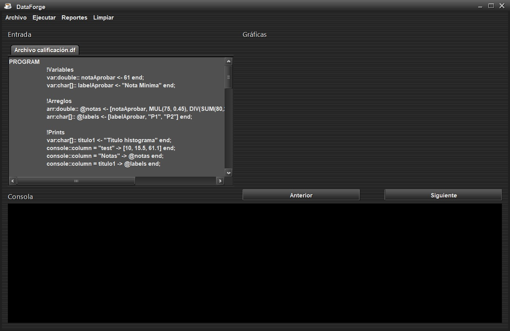
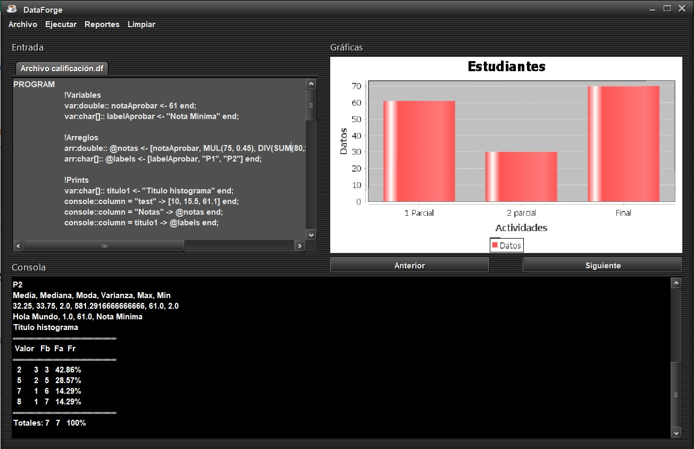
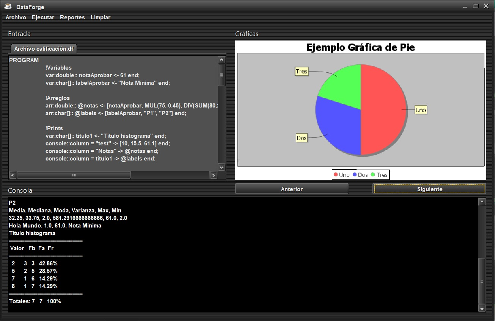
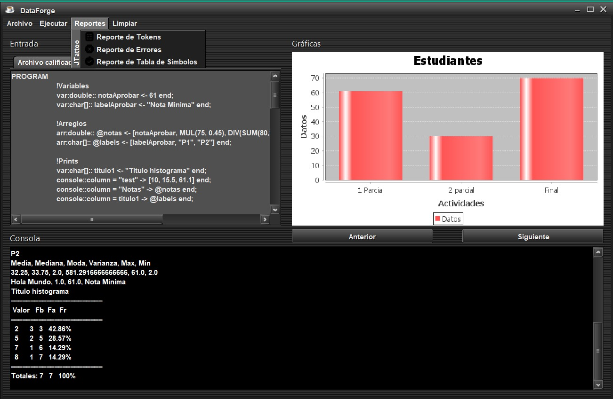
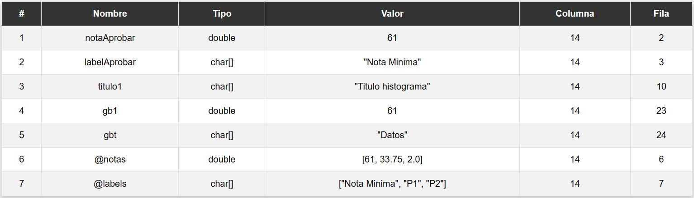
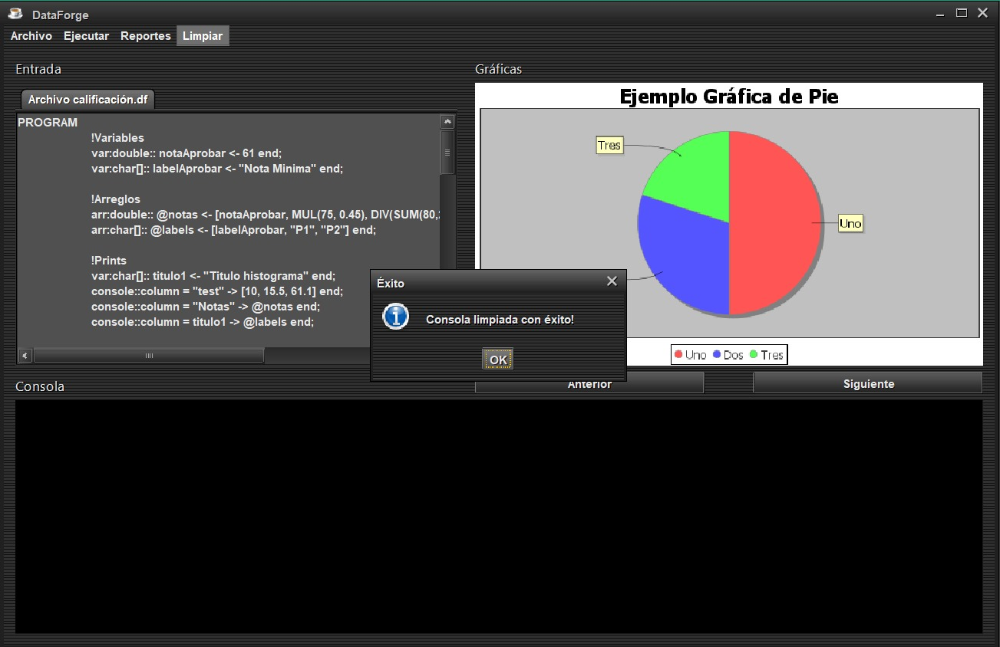

# MANUAL DE USUARIO
## Luis Carlos Corleto Marroquín
### Proyecto 1 - DataForge
### Objetivo general:
Aplicar los conocimientos sobre la fase de análisis léxico y sintáctico de un
compilador para la construcción de una solución de software.
### Objetivos específicos:
* Que el estudiante aprenda a generar analizadores léxicos y sintácticos
utilizando las herramientas de JFLEX y CUP.
* Que el estudiante aprenda los conceptos de token, lexema, patrones y
expresiones regulares.
* Que el estudiante pueda realizar correctamente el manejo de errores
léxicos.
* Que el estudiante sea capaz de realizar acciones gramaticales
utilizando el lenguaje de programación JAVA.
### Descripción General:
El curso de Organización de Lenguajes y Compiladores 1, perteneciente a la Facultad de Ingeniería de la Universidad de San Carlos de Guatemala, requiere de usted, como conocedor de la construcción de analizadores Léxico y Sintáctico, crear un sistema que sea capaz de realizar operaciones aritméticas y estadísticas, además de poder generar diversos gráficos a partir de una colección de datos.
### Aplicación 
#### Editor
El editor será parte del entorno de trabajo, cuya finalidad será proporcionar ciertas funcionalidades, características y herramientas que serán de utilidad para el usuario. La función principal del editor será el ingreso del código fuente que será analizado, tiene las siguientes funcionalidades:
1. **Nuevo archivo:** El editor tiene la capacidad de crear archivos en blanco el cual podrá ser editado en una pestaña que tiene el nombre del archivo.
2. **Abrir archivo:** El editor tiene la capacidad de abrir archivos con las extensiones .df cuyo contenido se deberá mostrar en el área de entrada en una nueva pestaña con el nombre del archivo.
3. **Guardar archivo:** El editor tiene la capacidad de guardar el estado del archivo en el que se estará trabajando.
4. **Eliminar archivo:** Cada pestaña puede ser cerrada en cualquier
momento. Si los cambios no se han guardado, se descartan.
**Interfaz**

**Funcionalidades mencionadas anteriormente**

**Abrir archivo**

Esta será la vista al momento de seleccionar un archivo y abrirlo, aquí el usuario podrá modificar el archivo, guardar los cambios, guardarlo como un archivo nuevo o eliminarlo de la consola, esto no quiere decir que se elimine el archivo del directorio seleccionado.

El botón ejecutar envía la entrada de la pestaña actualmente seleccionada al intérprete con la finalidad de realizar el análisis, léxico sintáctico y la ejecución de instrucciones.

Puede cambiar de gráfica con los botones "Anterior" y "Siguiente"

* **Reporte de Tokens:** se mostrarán todos los tokens reconocidos por el analizador léxico.
* **Reporte de errores:** se mostrarán todos los errores léxicos y sintácticos encontrados.
* **Reporte de Tabla de Símbolos:** se mostrarán todas las variables y arreglos declarados.
Cada botón abre el HTML generado al momento de la ejecución.

Por último, el usuario tiene la opción de limpiar la consola y todo lo analizado mediante el botón "Limpiar", si todo funciona correctamente mostrará un mensaje de éxito, esto permite al usuario analizar cuantos archivos quiera.
