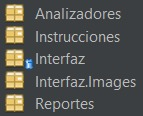
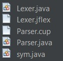
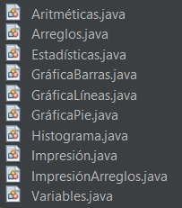
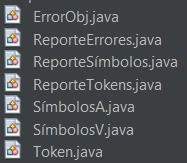

# MANUAL TÉCNICO
## Luis Carlos Corleto Marroquín
### Proyecto 1 - DataForge
### Objetivo general:
Aplicar los conocimientos sobre la fase de análisis léxico y sintáctico de un
compilador para la construcción de una solución de software.
### Objetivos específicos:
* Que el estudiante aprenda a generar analizadores léxicos y sintácticos
utilizando las herramientas de JFLEX y CUP.
* Que el estudiante aprenda los conceptos de token, lexema, patrones y
expresiones regulares.
* Que el estudiante pueda realizar correctamente el manejo de errores
léxicos.
* Que el estudiante sea capaz de realizar acciones gramaticales
utilizando el lenguaje de programación JAVA.
### Descripción General:
El curso de Organización de Lenguajes y Compiladores 1, perteneciente a la Facultad de Ingeniería de la Universidad de San Carlos de Guatemala, requiere de usted, como conocedor de la construcción de analizadores Léxico y Sintáctico, crear un sistema que sea capaz de realizar operaciones aritméticas y estadísticas, además de poder generar diversos gráficos a partir de una colección de datos.
### Estructura de la aplicación
#### Herramientas
Para el desarrollo del análisis léxico y sintáctico, se utilizaron las herramientas JFLEX y CUP, librerías de JAVA que facilitan la generación de los analizadores correspondientes.
#### Paquetes

#### Clases 



#### Funciones y métodos sustanciales
**Generación de los analizadores**
```
public static void analizadores(String ruta, String jflexFile, String cupFile) {
        try {
            String opcionesJflex[] = {ruta + jflexFile, "-d", ruta};
            jflex.Main.generate(opcionesJflex);

            String opcionesCup[] = {"-destdir", ruta, "-parser", "Parser", ruta + cupFile};
            java_cup.Main.main(opcionesCup);

        } catch (Exception e) {
            System.out.println("No se ha podido generar los analizadores");
            System.out.println(e);
        }
    }
```
**Método que permite analizar una entrada**
```
public static void analizar(String entrada) {
        try {
            Analizadores.Lexer lexer = new Analizadores.Lexer(new StringReader(entrada));
            Analizadores.Parser parser = new Parser(lexer);
            parser.parse();
        } catch (Exception e) {
            System.out.println("Error fatal en compilación de entrada.");
            System.out.println(e);
        }
    }
```
**Método ejecutar**
```
private void itemBarEjecutarMouseClicked(java.awt.event.MouseEvent evt) {                                             
        int tabIndex = panelArchivos.getSelectedIndex();

        if (tabIndex != -1) {
            JScrollPane selectedTab = (JScrollPane) panelArchivos.getComponentAt(tabIndex);
            JTextArea textArea = (JTextArea) selectedTab.getViewport().getView();

            String textoArchivo = textArea.getText();
            analizar(textoArchivo);
            String textoSalida = Analizadores.Parser.resultado;
            consolaArchivo.setText(textoSalida);
            mostrarGráficaActual();
            try {
                Reportes.ReporteTokens.generarReporteTokens();
                Reportes.ReporteErrores.generarReporteErrores();
                Reportes.ReporteSímbolos.generarReporteErrores();
            } catch (IOException ex) {
                Logger.getLogger(Interfaz.class.getName()).log(Level.SEVERE, null, ex);
            }
        }
    }
```
**Métodos y funciones para la generación de una gráfica de barras**
```
public class GráficaBarras {

    public static ArrayList<JFreeChart> listaGráficas = new ArrayList<>();

    public static JFreeChart generarGráfica(String tipo, String titulo, ArrayList<String> valoresEjeX, ArrayList<String> valoresEjeY, String tituloX, String tituloY) {
        switch (tipo) {
            case "graphBar" -> {
                JFreeChart chart = generarGráficaBarras(titulo, valoresEjeX, valoresEjeY, tituloX, tituloY);
                listaGráficas.add(chart);
                return chart;
            }
            default -> {
                return null;
            }
        }
    }

    public static JFreeChart generarGráficaBarras(String titulo, ArrayList<String> valoresEjeX, ArrayList<String> valoresEjeY, String tituloX, String tituloY) {
        DefaultCategoryDataset dataset = new DefaultCategoryDataset();

        titulo = titulo.replaceAll("\"", "");
        tituloX = tituloX.replaceAll("\"", "");
        tituloY = tituloY.replaceAll("\"", "");

        for (int i = 0; i < valoresEjeX.size(); i++) {
            valoresEjeX.set(i, valoresEjeX.get(i).replaceAll("\"", ""));
        }

        for (int i = 0; i < valoresEjeY.size(); i++) {
            valoresEjeY.set(i, valoresEjeY.get(i).replaceAll("\"", ""));
        }

        double[] valoresY = new double[valoresEjeY.size()];
        for (int i = 0; i < valoresEjeY.size(); i++) {
            valoresY[i] = Double.parseDouble(valoresEjeY.get(i));
        }

        for (int i = 0; i < valoresEjeX.size(); i++) {
            dataset.addValue(valoresY[i], tituloY, valoresEjeX.get(i));
        }

        return ChartFactory.createBarChart(
                titulo,
                tituloX,
                tituloY,
                dataset
        );
    }

    public static ArrayList<JFreeChart> getListaGráficas() {
        return listaGráficas;
    }
}
```
**Métodos para el almacenamiento de variables con su respectivo valor**
```
public class Variables {

    public static final HashMap<String, String> variables = new HashMap<>();

    public static void asignarVariable(String nombre, String valor) {
        variables.put(nombre, valor);
    }

    public static String obtenerVariable(String nombre) {
        return variables.getOrDefault(nombre, "");
    }

    public static boolean existeVariable(String nombre) {
        return variables.containsKey(nombre);
    }

    public static HashMap<String, String> obtenerVariables() {
        return variables;
    }
    
    public static void datosReporteVariables(String nombre, String tipo, String valor, String columna, String linea){
        ReporteSímbolos.TablaSímbolosVariables.add(new SímbolosV(nombre, tipo, valor, columna, linea));
    }
}
```
**Método para el almacenamiento de arreglos con sus respectivos valores**
```
public class Arreglos {

    public static final HashMap<String, ArrayList<String>> arreglos = new HashMap<>();
    private static final HashMap<String, String> variables = Variables.obtenerVariables();

    public static void asignarArray(String nombre, ArrayList<String> valores) {
        ArrayList<String> valoresAsignados = new ArrayList<>();
        for (String valor : valores) {
            if (variables.containsKey(valor)) {
                valoresAsignados.add(variables.get(valor));
            } else {
                valoresAsignados.add(valor); 
            }
        }
        arreglos.put(nombre, valoresAsignados);
        
    }

    public static ArrayList<String> obtenerArray(String nombre) {
        return arreglos.getOrDefault(nombre, new ArrayList<>());
    }

    public static boolean existeArray(String nombre) {
        return arreglos.containsKey(nombre);
    }
    
    public static void datosReporteArreglo(String nombre, String tipo, ArrayList<String> valores, String columna, String fila){
        ReporteSímbolos.TablaSímbolosArreglos.add(new SímbolosA(nombre, tipo, valores, columna, fila));
    }
}
```
**Método para la resolución de las operaciones aritméticas**
```
public class Aritméticas {

    private static boolean esNumero(String str) {
        try {
            Double.valueOf(str);
            return true;
        } catch (NumberFormatException e) {
            return false;
        }
    }

    public static String realizarOperación(String operacion, String izq, String der) {
        double valIzq, valDer;
        try {
            if (esNumero(izq)) {
                valIzq = Double.parseDouble(izq);
            } else {
                if (Variables.existeVariable(izq)) {
                    valIzq = Double.parseDouble(Instrucciones.Variables.obtenerVariable(izq));
                } else {
                    return "Error: Variable " + izq + " no encontrada";
                }
            }
            if (esNumero(der)) {
                valDer = Double.parseDouble(der);
            } else {
                if (Variables.existeVariable(der)) {
                    valDer = Double.parseDouble(Instrucciones.Variables.obtenerVariable(der));
                } else {
                    return "Error: Variable " + der + " no encontrada";
                }
            }
        } catch (NumberFormatException e) {
            return "Error: El valor no es numérico";
        }

        switch (operacion) {
            case "SUM" -> {
                return String.valueOf(valIzq + valDer);
            }
            case "RES" -> {
                return String.valueOf(valIzq - valDer);
            }
            case "MUL" -> {
                return String.valueOf(valIzq * valDer);
            }
            case "DIV" -> {
                if (valDer != 0) {
                    return String.valueOf(valIzq / valDer);
                } else {
                    return "Error: División por cero";
                }
            }
            case "MOD" -> {
                return String.valueOf(valIzq % valDer);
            }
            default -> {
                return "Error: Operación no válida";
            }
        }
    }
}
```
**Método para la resolución de las operaciones estadísticas**
```
public class Estadísticas {

    public static String realizarOperaciónEstadística(String operacion, ArrayList<String> valores) {
        switch (operacion) {
            case "Media" -> {
                return calcularMedia(valores);
            }
            case "Mediana" -> {
                return calcularMediana(valores);
            }
            case "Moda" -> {
                return calcularModa(valores);
            }
            case "Varianza" -> {
                return calcularVarianza(valores);
            }
            case "Max" -> {
                return calcularMaximo(valores);
            }
            case "Min" -> {
                return calcularMinimo(valores);
            }
            default -> {
                return "Error: Operación no válida";
            }
        }
    }

    private static String calcularMedia(ArrayList<String> valores) {
        double suma = 0;
        for (String valor : valores) {
            suma += Double.parseDouble(valor);
        }
        double media = suma / valores.size();
        return String.valueOf(media);
    }

    private static String calcularMediana(ArrayList<String> valores) {
        ArrayList<Double> numeros = new ArrayList<>();
        for (String valor : valores) {
            numeros.add(Double.valueOf(valor));
        }
        Collections.sort(numeros);
        int n = numeros.size();
        if (n % 2 == 0) {
            double mediana = (numeros.get(n / 2 - 1) + numeros.get(n / 2)) / 2.0;
            return String.valueOf(mediana);
        } else {
            double mediana = numeros.get(n / 2);
            return String.valueOf(mediana);
        }
    }

    private static String calcularModa(ArrayList<String> valores) {
        Map<String, Integer> frecuencia = new HashMap<>();
        for (String valor : valores) {
            frecuencia.put(valor, frecuencia.getOrDefault(valor, 0) + 1);
        }
        int maxFrecuencia = 0;
        String moda = null;
        for (Map.Entry<String, Integer> entry : frecuencia.entrySet()) {
            if (entry.getValue() > maxFrecuencia) {
                moda = entry.getKey();
                maxFrecuencia = entry.getValue();
            }
        }
        return moda;
    }

    private static String calcularVarianza(ArrayList<String> valores) {
        double media = Double.parseDouble(calcularMedia(valores));
        double sumaDiferenciasCuadradas = 0;
        for (String valor : valores) {
            double diferencia = Double.parseDouble(valor) - media;
            sumaDiferenciasCuadradas += diferencia * diferencia;
        }
        double varianza = sumaDiferenciasCuadradas / valores.size();
        return String.valueOf(varianza);
    }

    private static String calcularMaximo(ArrayList<String> valores) {
        double max = Double.MIN_VALUE;
        for (String valor : valores) {
            double num = Double.parseDouble(valor);
            if (num > max) {
                max = num;
            }
        }
        return String.valueOf(max);
    }

    private static String calcularMinimo(ArrayList<String> valores) {
        double min = Double.MAX_VALUE;
        for (String valor : valores) {
            double num = Double.parseDouble(valor);
            if (num < min) {
                min = num;
            }
        }
        return String.valueOf(min);
    }
}
```
**Métodos para la impresión de arreglos**
```
public class ImpresiónArreglos {

    public static String imprimirArreglo(String titulo, ArrayList<String> arreglo) {
        StringBuilder consola = new StringBuilder();

        if (Variables.existeVariable(titulo)) {
            titulo = Variables.obtenerVariable(titulo);
        }

        consola.append("--------------").append(System.lineSeparator());
        consola.append(titulo.replaceAll("\"", "")).append(System.lineSeparator()); 
        consola.append("--------------").append(System.lineSeparator());

        for (String elemento : arreglo) {
            consola.append(elemento.replaceAll("\"", "")).append(System.lineSeparator()); 
        }

        resultado += consola.toString();
        return resultado;
    }

    public static String imprimirArregloPorNombre(String titulo, String nombreArreglo) {
        StringBuilder consola = new StringBuilder();

        if (Variables.existeVariable(titulo)) {
            titulo = Variables.obtenerVariable(titulo);
        }

        ArrayList<String> arreglo = Arreglos.obtenerArray(nombreArreglo);

        consola.append("--------------").append(System.lineSeparator());
        consola.append(titulo.replaceAll("\"", "")).append(System.lineSeparator()); 
        consola.append("--------------").append(System.lineSeparator());

        for (String elemento : arreglo) {
            consola.append(elemento.replaceAll("\"", "")).append(System.lineSeparator()); 
        }

        resultado += consola.toString();
        return resultado;
    }
}
```
**Método para la generación del reporte en un archivo HTML**
```
public class ReporteTokens {

    public static ArrayList<Token> TablaTokens = new ArrayList();

    public static void generarReporteTokens() throws FileNotFoundException, IOException {
        String nombreArchivo = "Reporte de Tokens.html";

        try (FileOutputStream archivoStream = new FileOutputStream(nombreArchivo); OutputStreamWriter escritorStream = new OutputStreamWriter(archivoStream, StandardCharsets.UTF_8); BufferedWriter archivo = new BufferedWriter(escritorStream)) {

            archivo.write("<!DOCTYPE html>\n");
            archivo.write("<html>\n");
            archivo.write("<head>\n");
            archivo.write("<meta charset=\"UTF-8\">\n");
            archivo.write("<title>Reporte de Tokens</title>\n");
            archivo.write("""
                          <style>
                                                  body {
                                                      margin: 0;
                                                      padding: 0;
                                                      font-family: Arial, sans-serif;
                                                      background-color: #f2f2f2;
                                                  }
                          
                                                  header {
                                                      background-color: #333;
                                                      color: #fff;
                                                      text-align: center;
                                                      padding: 20px;
                                                  }
                          
                                                  h1 {
                                                      font-size: 24px;
                                                  }
                          
                                                  table {
                                                      width: 80%;
                                                      margin: 20px auto;
                                                      background-color: #fff;
                                                      border-collapse: collapse;
                                                      box-shadow: 0 4px 8px 0 rgba(0, 0, 0, 0.2);
                                                  }
                          
                                                  th, td {
                                                      text-align: center;
                                                      padding: 12px;
                                                      border: 1px solid #ddd;
                                                  }
                          
                                                  th {
                                                      background-color: #333;
                                                      color: #fff;
                                                  }
                          
                                                  tr:nth-child(even) {
                                                      background-color: #f2f2f2;
                                                  }
                                              </style>""");
            archivo.write("</head>\n");
            archivo.write("<body>\n");

            archivo.write("<table border=\"1\">\n");
            archivo.write("<tr><th>#</th><th>Tipo</th><th>Lexema</th><th>Línea</th><th>Columna</th></tr>\n");
            
            int numeral = 1;
            for (Token símbolo : TablaTokens) {
                archivo.write("<tr>");
                archivo.write("<td>" + numeral++ + "</td>");
                archivo.write("<td>" + símbolo.getToken() + "</td>");
                archivo.write("<td>" + símbolo.getLexema() + "</td>");
                archivo.write("<td>" + símbolo.getLínea() + "</td>");
                archivo.write("<td>" + símbolo.getColumna() + "</td>");
                archivo.write("</tr>\n");
            }

            archivo.write("</table>\n");
            archivo.write("</body>\n");
            archivo.write("</html>\n");
        }
        System.out.println("El reporte de tokens se ha generado correctamente en " + nombreArchivo);
    }
}
```